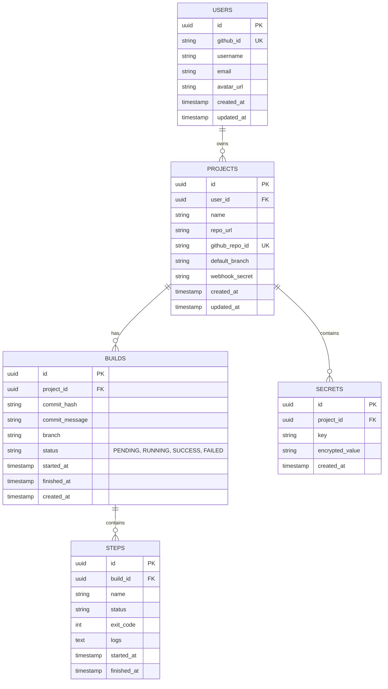

# NanoCI - Database Schema

## 1. Entity Relationship Diagram (Textual)

## 2. Table Definitions (PostgreSQL)

### 2.1. Users
Stores user identity authenticated via GitHub.
- `id`: UUID, Primary Key.
- `github_id`: String, Unique, ID from GitHub API.
- `username`: String.
- `email`: String.
- `avatar_url`: String.
- `created_at`: Timestamp.
- `updated_at`: Timestamp.

### 2.2. Projects
Represents a GitHub repository that NanoCI is watching.
- `id`: UUID, Primary Key.
- `user_id`: UUID, Foreign Key -> Users.id (Owner).
- `name`: String (e.g., "princetheprogrammer/nanoci").
- `repo_url`: String (HTTPS clone URL).
- `github_repo_id`: String, Unique (GitHub's internal ID).
- `default_branch`: String (e.g., "main").
- `webhook_secret`: String (Used to verify signatures).
- `created_at`: Timestamp.
- `updated_at`: Timestamp.

### 2.3. Secrets
Environment variables encrypted at rest.
- `id`: UUID, Primary Key.
- `project_id`: UUID, Foreign Key -> Projects.id.
- `key`: String (e.g., "AWS_ACCESS_KEY").
- `encrypted_value`: String (Base64 encoded ciphertext).
- `created_at`: Timestamp.

### 2.4. Builds
A single execution of a pipeline.
- `id`: UUID, Primary Key.
- `project_id`: UUID, Foreign Key -> Projects.id.
- `commit_hash`: String.
- `commit_message`: String.
- `branch`: String.
- `status`: Enum (PENDING, RUNNING, SUCCESS, FAILED, CANCELLED).
- `started_at`: Timestamp (Nullable).
- `finished_at`: Timestamp (Nullable).
- `created_at`: Timestamp.

### 2.5. Steps (Optional/Advanced)
Granular tracking of each step in the pipeline.
- `id`: UUID, Primary Key.
- `build_id`: UUID, Foreign Key -> Builds.id.
- `name`: String (Step name from .nanoci.yml).
- `status`: Enum.
- `exit_code`: Integer.
- `started_at`: Timestamp.
- `finished_at`: Timestamp.
